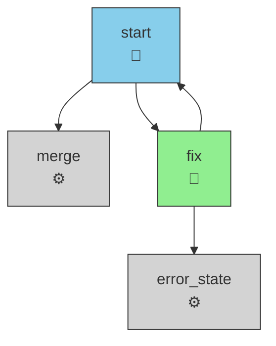

# RAI-72: Fix `raili visual` creating invalid mermaid diagrams

**Type:** bug

## Description
The `raili visual` command produces invalid Mermaid diagram syntax. Specifically:
1. The `[*] -->|initial| <state>` syntax is invalid in Mermaid's `graph TD` format (pseudo-state transitions are not supported in flowchart).
2. The `Note over <state>: <text>` syntax is invalid for Mermaid flowcharts (note syntax is for sequence diagrams, not flowcharts).
3. State type labels display as plain text (e.g., "agent") instead of descriptive emojis that map to state type semantics.

The generated diagrams are not renderable in Mermaid editors and fail silent validation checks.

## Documentation References
- documentation/visual.md

## Code References
- src/cli/mermaidRenderer.ts (renderMermaid function — generates invalid syntax)
- src/presenter.ts (EMOJI_MAP constant — defines emoji mappings)

## Implementation Plan

1. **src/cli/mermaidRenderer.ts** — Fix invalid Mermaid syntax
   - Remove the `[*] -->|initial| ${initialTarget}` line (lines 24-26)
   - Replace `Note over` annotations with valid Mermaid comment syntax or annotations (lines 55-69)
   - Update `nodeLabel()` function to use emoji from EMOJI_MAP instead of plain type text

2. **src/cli/mermaidRenderer.ts** — Import and use EMOJI_MAP
   - Import `EMOJI_MAP` from `src/presenter.ts` at the top of the file
   - Modify `nodeLabel()` to format state labels with type emoji (e.g., `init<br/>🤖` for agent state)

## Examples

### Example workflow YAML
```yaml
initial: start
states:
  start:
    type: agent
    agent: analyzer
    output:
      store: true
    max_visits:
      count: 3
    transitions:
      approve: merge
      reject: fix

  fix:
    type: script
    script: run_tests
    on:
      PASSED: start
      FAILED: error_state

  merge:
    type: engine

  error_state:
    type: engine
```

### Expected output (valid Mermaid)

**Before (invalid):**
```mermaid
graph TD
[*] -->|initial| start
start["start<br/>agent"]
merge["merge<br/>engine"]
error_state["error_state<br/>engine"]
fix["fix<br/>script"]
style start fill:#87CEEB,stroke:#333,stroke-width:1px
style merge fill:#D3D3D3,stroke:#333,stroke-width:1px
style error_state fill:#D3D3D3,stroke:#333,stroke-width:1px
style fix fill:#90EE90,stroke:#333,stroke-width:1px
Note over start: max_visits=3, output.store=true
Note over merge: N/A
Note over error_state: N/A
Note over fix: N/A
start --> merge
start --> fix
fix --> start
fix --> error_state
```

**After (valid and with emoji):**


Key changes:
- ❌ Removed: `[*] -->|initial| start` (invalid pseudo-state syntax)
- ❌ Removed: `Note over` annotations (invalid in flowchart context)
- ✅ Changed state labels from `state<br/>type` to `state<br/>emoji` (e.g., `start<br/>🤖`)

## Test Plan

### Unit tests (`__tests__/unit/cli/`)

**Test case 1: "renderMermaid() produces valid mermaid syntax without pseudo-state"**
- Setup: Create a Graph with initial state `start` and one terminal state `done`
- Act: Call `renderMermaid(graph)`
- Assert:
  - Output should NOT contain `[*]` (no pseudo-state)
  - Output should NOT contain `Note over` syntax
  - Output should start with `graph TD`
  - Output should contain state definitions like `start["start<br/>🤖"]`

**Test case 2: "renderMermaid() emits emoji for each state type"**
- Setup: Create a Graph with four nodes: one `agent`, one `script`, one `command`, one `engine`
- Act: Call `renderMermaid(graph)`
- Assert:
  - Output contains `🤖` for agent state
  - Output contains `📜` for script state
  - Output contains `📢` for command state
  - Output contains `⚙️` for engine state
  - No plain type text (e.g., "agent", "script") appears in labels

**Test case 3: "renderMermaid() still renders edges and styles correctly"**
- Setup: Create a Graph with nodes and multiple edges (binary outcome and transitions)
- Act: Call `renderMermaid(graph)`
- Assert:
  - All edges render (e.g., `a --> b`, `c -->|outcome| d`)
  - All style lines remain (e.g., `style a fill:#87CEEB,stroke:#333,stroke-width:1px`)

### Integration tests (`__tests__/integration/`)

**Test case: "raili visual produces a valid, renderable mermaid diagram"**
```typescript
// Create temp workspace and workflow
const tmp = createTmpWorkspace();
writeWorkflow(tmp, `
initial: start
states:
  start:
    type: agent
    agent: analyzer
    output:
      store: true
    max_visits:
      count: 2
    transitions:
      approve: merge
      reject: fix
  
  fix:
    type: script
    script: run_tests
    on:
      PASSED: start
      FAILED: error
  
  merge:
    type: engine
  
  error:
    type: engine
`);
writeAgentRegistry(tmp, { analyzer: { path: '.github/agents/analyzer.md' } });
writeScriptRegistry(tmp, { run_tests: { path: 'scripts/test.sh' } });

// Run visual command
jest.spyOn(console, 'log').mockImplementation();
const { visualCommand } = require('../../../src/cli/visual');
visualCommand(tmp, 'main', 'mermaid', '-');

// Assert output
const output = (console.log as jest.Mock).mock.calls[0][0];
expect(output).toContain('graph TD');
expect(output).not.toContain('[*]');
expect(output).not.toContain('Note over');
expect(output).toContain('🤖');
expect(output).toContain('📜');
expect(output).toContain('⚙️');
expect(output).toContain('start["start<br/>🤖"]');
expect(output).toContain('fix["fix<br/>📜"]');
expect(output).toContain('merge["merge<br/>⚙️"]');
```

## Acceptance Criteria
- [ ] `renderMermaid()` function no longer emits `[*]` pseudo-state transitions
- [ ] `renderMermaid()` function no longer emits `Note over` annotations
- [ ] All state labels display emoji from EMOJI_MAP instead of plain type text
- [ ] Generated mermaid diagrams are valid and pass Mermaid syntax validation (no render errors)
- [ ] Emoji mapping matches presenter.ts EMOJI_MAP: agent→🤖, script→📜, command→📢, engine→⚙️
- [ ] All existing unit tests pass with updated implementation
- [ ] All existing integration tests pass with updated implementation
- [ ] `raili visual` command produces renderable HTML and .mmd files
