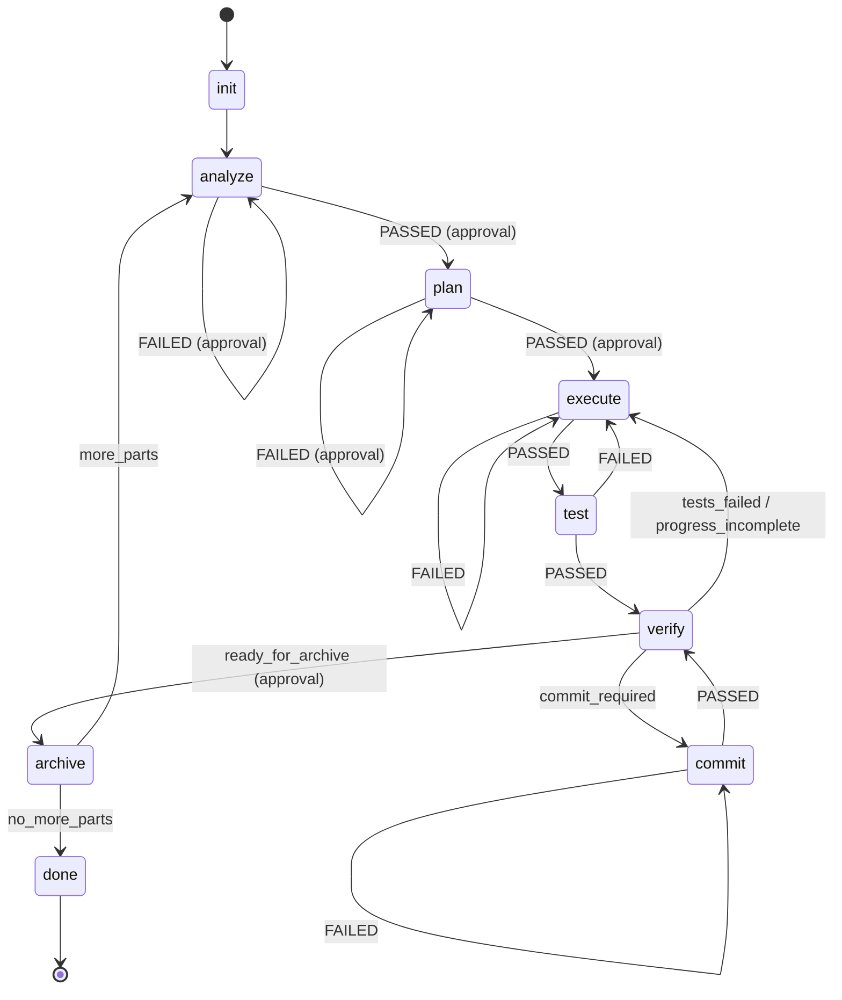

# Raili Workflow States Specification

This document defines all workflow states for the Raili MVP, including a reusable manual approval state.

All files are stored in the `.raili/` directory, which is created by `raili init` command.

---

## State Overview



States with an `approval` block in `workflow.yaml` automatically pause for
user confirmation after execution. The engine handles this inline — there are
no separate `approve_*` states in the workflow.

States with a `transitions:` block signal their outcome via the **last line
of stdout**. The engine matches it against the transition keys and routes
accordingly. A state may not have both `on:` and `transitions:`.

---

# 1. Init

type: engine  
run: manual  

Collects ticket ID and description.

Inputs:
- CLI input (ticket ID and description)

Outputs:
- `prompt.md` (user input)

Success Criteria:
- Output files created

On success:
- analyze

On fail:
- retry init

---

# 2. Analyze

type: agent  
run: automatic  

Splits ticket into ptN work files.

Inputs:
- `prompt.md` (ticket ID and description)

Outputs:
- `<TICKET>-ptN-*.md` files

Success Criteria:
- No agent error

On success:
- manual-approve (analysis approval)

On fail:
- init

---

# 3. Manual Approval (Inline)

type: engine (inline behavior, not a separate state)
run: manual

When a state in `workflow.yaml` has an `approval` block, the engine
automatically pauses after that state completes and prompts the user
before transitioning. No separate state is needed.

The engine:

1. Executes the state handler normally.
2. Checks if the state config has an `approval` block.
3. If yes, prompts the user with `approval.question`.
4. Routes to `approval.PASSED` or `approval.FAILED` based on user input.

Example workflow.yaml snippet:

```yaml
plan:
  type: agent
  agent: planner.agent
  approval:
    question: "Is the implementation plan correct?"
    PASSED: execute
    FAILED: plan
```


---

# 4. Plan

type: agent  
run: automatic  

Creates implementation plan and progress file.

Inputs:
- ptN work file
- Specifications
- Examines project source

Outputs:
- `<TICKET-ID>-<ptN>-implementation_plan.md`
- `<TICKET-ID>-<ptN>-implementation_plan_spec.md` (Relevant parts of specification)
- `<TICKET-ID>-<ptN>-implementation_plan_progress.md`
- One to many `commit-msg-*.txt` files, if commits required for the plan.

Success Criteria:
- No agent error

On success:
- manual-approve (plan approval)

On fail:
- analyze

---

# 5. Execute

type: agent  
run: automatic  

Implements next unchecked step from progress file.

Inputs:
- implementation plan
- implementation plan specifications
- progress file
- `test-results.txt` (optional test feedback)

Outputs:
- Modified source files
- Updated progress file
- Optional `commit-msg-*.txt`

Success Criteria:
- Step marked complete in progress file
- No agent crash

On success:
- test

On fail:
- execute (retry or abort)

---

# 6. Test

type: script  
run: automatic  

Runs project tests deterministically. Before running, deletes the existing `test-results.txt` to ensure results are from the current test run. The test command is defined in the script registry and can be customized per project.

Inputs:
- Source code
- Test command from script registry

Outputs:
- `test-results.txt`

Success Criteria:
- Test command completes

On success:
- verify

On fail:
- execute

---

# 7. Verify

type: agent  
run: automatic  

Determines next state based on workflow status.

Inputs:
- `test-results.txt`
- `implementation_plan_progress.md`
- commit message files (if any)

Decision Logic:
- If tests failed → `tests_failed`
- If progress indicates commit required → `commit_required`
- If progress incomplete → `progress_incomplete`
- If progress complete → `ready_for_archive`

Outputs:
- Last stdout line: one of `tests_failed`, `commit_required`,
  `progress_incomplete`, `ready_for_archive`

The engine reads the last stdout line and routes via `transitions:`.
If `ready_for_archive` is returned and the state has an `approval` block,
the engine pauses for user confirmation before transitioning to archive.

On named outcomes:
- `tests_failed` → execute
- `commit_required` → commit
- `progress_incomplete` → execute
- `ready_for_archive` → archive (with approval)

---

# 8. Commit

type: script  
run: automatic  

Creates a Git commit using next available commit message file.

Inputs:
- `commit-msg-*.txt`
- Working tree changes

Outputs:
- Git commit created
- Commit message file removed

Success Criteria:
- Commit succeeds
- File deleted after successful commit

On success:
- verify

On fail:
- retry commit or abort

---

# 9. Archive

type: script  
run: automatic  

Archives completed ptN and prepares next part.

Inputs:
- `archive.sh <part-number>`
- Current ptN files

Outputs:
- Archived ptN files
- Updated workflow context
- Last stdout line: `more_parts` or `no_more_parts`

Success Criteria:
- Archive script succeeds

On named outcomes:
- `more_parts` → analyze
- `no_more_parts` → done

---

# 10. Done

type: engine  
run: automatic  

Workflow completed successfully.

Inputs:
- None

Outputs:
- Final completion message

On success:
- end

On fail:
- N/A

---

# Architectural Principles

- Only agents perform cognitive tasks.
- Only scripts perform shell operations.
- Manual approval is inline: a state with an `approval` block in `workflow.yaml` automatically pauses the engine for user confirmation.
- Binary outcomes use `on: PASSED/FAILED` (exit code). Named outcomes use `transitions:` (last stdout line). A state may not have both.
- Progress file is the single source of truth for work status.
- Engine controls all transitions deterministically.
