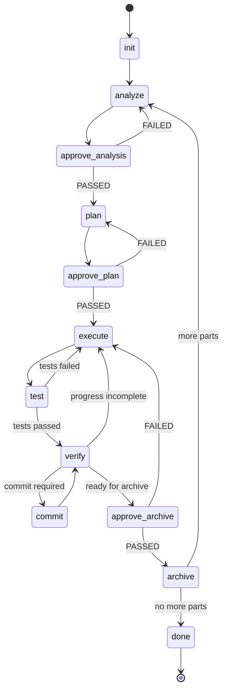

# Raili Workflow States Specification

This document defines all workflow states for the Raili MVP, including a reusable manual approval state.

All files are stored in the `.raili/` directory, which is created by `raili init` command.

---

## State Overview



approve_* states are instances of the reusable manual approval state, with context determining the question and next states.

---

# 1. Init

type: engine  
run: manual  

Collects ticket ID and description.

Inputs:
- CLI input (ticket ID and description)

Outputs:
- `prompt.md` (user input)

Success Criteria:
- Output files created

On success:
- analyze

On fail:
- retry init

---

# 2. Analyze

type: agent  
run: automatic  

Splits ticket into ptN work files.

Inputs:
- `prompt.md` (ticket ID and description)

Outputs:
- `<TICKET>-ptN-*.md` files

Success Criteria:
- No agent error

On success:
- manual-approve (analysis approval)

On fail:
- init

---

3. Manual-Approve (Reusable)

type: engine  
run: manual

Generic human approval gate used after states that require explicit confirmation (e.g., analyze, plan, archive).

The engine:

1. Reads the **previous state** from `stateHistory` (the state that led to manual-approve). This is always the latest state according to timestamp.
2. Loads that state's definition from `workflow.yaml`.
3. Reads:
   - `approval.question`
   - `approval.PASSED`
   - `approval.FAILED`
4. Prompts the user (CLI).
5. Transitions according to the workflow definition.

### Inputs

- `context.stateHistory` (last state before manual-approve)
- `workflow.yaml` state definition for that state

Example context.stateHistory (raili engine always creates entries in this format, so the engine can reliably read the last state and its timestamp):

```
[
  {
    "state": "analyze",
    "enteredAt": "2026-02-20T12:00:00Z"
  }
]
```

Example workflow.yaml snippet:

```yaml
plan:
  type: agent
  approval:
    question: "Is the implementation plan correct?"
    PASSED: execute
    FAILED: plan
```

### Outputs

- User decision (PASSED / FAILED)

- New state appended to `stateHistory`

  ```
  {
    "state": "execute",
    "enteredAt": "2026-02-20T12:45:00Z"
  }
  ```


### Success Criteria

- User explicitly PASSED the approval.

### On success

- Transition to `approval.PASSED` (from workflow.yaml)

### On fail

- Transition to `approval.FAILED` (from workflow.yaml)

---

# 4. Plan

type: agent  
run: automatic  

Creates implementation plan and progress file.

Inputs:
- ptN work file
- Specifications
- Examines project source

Outputs:
- `<TICKET-ID>-<ptN>-implementation_plan.md`
- `<TICKET-ID>-<ptN>-implementation_plan_spec.md` (Relevant parts of specification)
- `<TICKET-ID>-<ptN>-implementation_plan_progress.md`
- One to many `commit-msg-*.txt` files, if commits required for the plan.

Success Criteria:
- No agent error

On success:
- manual-approve (plan approval)

On fail:
- analyze

---

# 5. Execute

type: agent  
run: automatic  

Implements next unchecked step from progress file.

Inputs:
- implementation plan
- implementation plan specifications
- progress file
- `test-results.txt` (optional test feedback)

Outputs:
- Modified source files
- Updated progress file
- Optional `commit-msg-*.txt`

Success Criteria:
- Step marked complete in progress file
- No agent crash

On success:
- test

On fail:
- execute (retry or abort)

---

# 6. Test

type: script  
run: automatic  

Runs project tests deterministically. Before running, deletes the existing `test-results.txt` to ensure results are from the current test run. The test command is defined in the script registry and can be customized per project.

Inputs:
- Source code
- Test command from script registry

Outputs:
- `test-results.txt`

Success Criteria:
- Test command completes

On success:
- verify

On fail:
- execute

---

# 7. Verify

type: agent  
run: automatic  

Determines next state based on workflow status.

Inputs:
- `test-results.txt`
- `implementation_plan_progress.md`
- commit message files (if any)

Decision Logic:
- If tests failed → execute
- If progress indicates commit required → commit
- If progress incomplete → execute
- If progress complete → manual-approve (archive approval)

Outputs:
- Internal routing decision

On success:
- execute
- commit
- manual-approve (archive)
- archive (if no approval required)

On fail:
- execute

---

# 8. Commit

type: script  
run: automatic  

Creates a Git commit using next available commit message file.

Inputs:
- `commit-msg-*.txt`
- Working tree changes

Outputs:
- Git commit created
- Commit message file removed

Success Criteria:
- Commit succeeds
- File deleted after successful commit

On success:
- verify

On fail:
- retry commit or abort

---

# 9. Archive

type: script  
run: automatic  

Archives completed ptN and prepares next part.

Inputs:
- `archive.sh <part-number>`
- Current ptN files

Outputs:
- Archived ptN files
- Updated workflow context

Success Criteria:
- Archive script succeeds

On success:
- analyze (if more ptN remain)
- done (if no more parts)

On fail:
- retry archive

---

# 10. Done

type: engine  
run: automatic  

Workflow completed successfully.

Inputs:
- None

Outputs:
- Final completion message

On success:
- end

On fail:
- N/A

---

# Architectural Principles

- Only agents perform cognitive tasks.
- Only scripts perform shell operations.
- Manual approval is centralized in a single reusable state.
- Progress file is the single source of truth.
- Engine controls all transitions deterministically.
